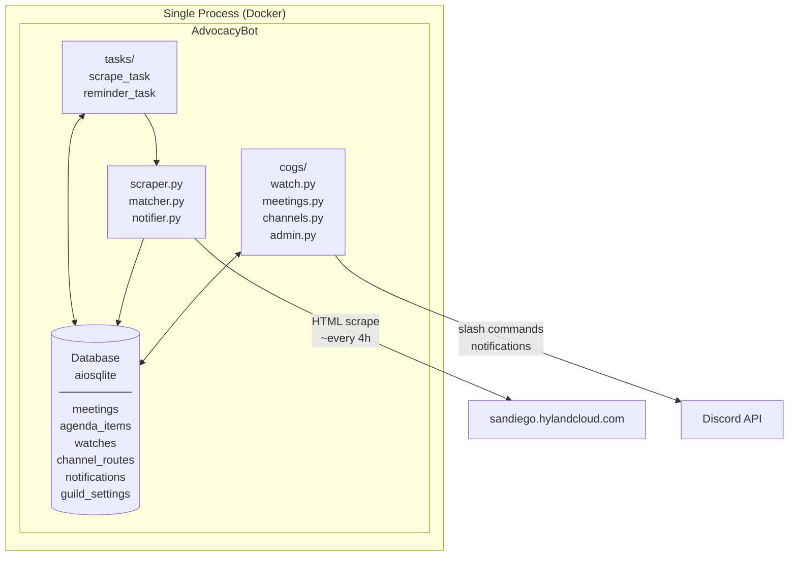
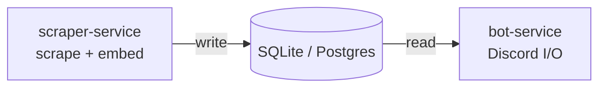

# advocacy_bot

A Discord bot that monitors San Diego City Council meeting agendas and notifies users when topics they care about appear. Helps advocates stay on top of public comment opportunities without manually checking the portal.

## Required Info

- **Team name:** Advocacy Bot
- **Team members:** Chris Chow, Andres Kodaka
- **Problem statement:** San Diego residents who want to participate in city council meetings have no easy way to track when topics they care about appear on upcoming agendas. They must manually check the Hyland portal, which is tedious and easy to miss.
- **What it does:** A Discord bot that scrapes San Diego city council meeting agendas from the Hyland Agenda Online portal and sends alerts when watched keywords appear on upcoming agendas. Users subscribe to topics via slash commands and receive notifications with meeting details, matched agenda items, and public comment opportunities.
- **Data sources used:** [San Diego City Council Hyland Agenda Online portal](https://sandiego.hylandcloud.com/211agendaonlinecouncil) — meeting schedules, agenda documents, and public comment listings
- **Architecture / approach:** Python Discord bot (`discord.py`) with background tasks that periodically scrape the Hyland portal (`httpx` + `BeautifulSoup`), store meetings/agendas in SQLite (`aiosqlite`), match against user keyword watches, and send Discord embed notifications with dedup and per-topic channel routing.
- **Links:** TBD
- **Demo video:** TBD

## Architecture

Everything runs in a single process (one Docker container). The scraper fetches the Hyland portal every 4 hours; the bot handles Discord I/O and user commands.



### Future: separating the scraper

If semantic matching (embeddings, clustering) is added, the ML model load and memory pressure make a split worthwhile. The natural boundary is the shared database:



The scraper writes meetings and items; the bot reads and sends notifications. No message queue needed as long as both services share a database.

## Commands

| Command | Permission | Description |
|---|---|---|
| `/watch <keyword>` | Any user | Subscribe to topic alerts |
| `/unwatch <keyword>` | Any user | Remove subscription |
| `/mywatches` | Any user | List your watches |
| `/nextmeeting` | Any user | Show upcoming meetings |
| `/agenda [meeting_id]` | Any user | Show agenda items |
| `/search <keyword>` | Any user | Search current agendas |
| `/setchannel [channel]` | Manage Channels | Set default alert channel |
| `/routetopic <keyword> <channel>` | Manage Channels | Route topic to channel |
| `/routes` | Manage Channels | List all routes |
| `/setreminder <hours>` | Manage Channels | Set reminder lead time |
| `/settings` | Manage Channels | View guild settings |
| `/forcescrape` | Administrator | Trigger immediate scrape |
| `/botstatus` | Administrator | Bot health/stats |

## Deployment

Requires Docker with the Compose plugin on the host.

**First time:**

```sh
git clone https://github.com/ako89/advocacy_bot.git
cd advocacy_bot
cp .env.example .env
# Edit .env and set DISCORD_TOKEN
docker compose up -d --build
```

**Updates:**

```sh
bash scripts/deploy.sh
```

**Logs:**

```sh
docker compose logs -f
```

## Judging Criteria

Evaluation framework from the [City of SD Impact Lab Hackathon](https://github.com/Backland-Labs/city-of-sd-hackathon). Four categories, each scored 1-5, totaling 20 points maximum.

### 1. Civic Impact (1-5)

"Does this solve a real problem for San Diego residents, city staff, or the community?"

| Score | Criterion |
|-------|-----------|
| 5 | Addresses a clear, pressing civic need with a compelling use case |
| 4 | Solves a real problem with a well-defined audience |
| 3 | Useful concept, but the target user or problem could be sharper |
| 2 | Loosely connected to a civic use case |
| 1 | No clear civic relevance |

**Bonus:** Solutions enabling broader access (MCP servers, CLIs, agentic tools) receive preference.

### 2. Use of City Data (1-5)

Effective integration of San Diego's open data, municipal code, council records, or other city resources.

| Score | Criterion |
|-------|-----------|
| 5 | Deeply integrates multiple city data sources in a meaningful way |
| 4 | Strong use of at least one city data source with clear value |
| 3 | Uses city data, but doesn't go beyond surface-level access |
| 2 | Minimal or superficial use of city data |
| 1 | No meaningful use of city data |

**Bonus:** Creative dataset combinations (permits with zoning, 311 with budgets) earn higher marks.

### 3. Technical Execution (1-5)

Functionality and polish appropriate for the hackathon timeframe.

| Score | Criterion |
|-------|-----------|
| 5 | Fully functional, polished, and well-scoped for the time available |
| 4 | Working demo with minor rough edges |
| 3 | Core functionality works but notable gaps or bugs |
| 2 | Partially working; significant issues during demo |
| 1 | Non-functional or unable to demo |

### 4. Presentation & Story (1-5)

Clear communication of what was built, why it matters, and intended audience.

| Score | Criterion |
|-------|-----------|
| 5 | Compelling narrative, clear demo, and strong delivery |
| 4 | Well-structured presentation with a clear problem/solution arc |
| 3 | Adequate presentation but missing clarity on problem, audience, or impact |
| 2 | Disorganized or hard to follow |
| 1 | No clear communication of the project's purpose |
